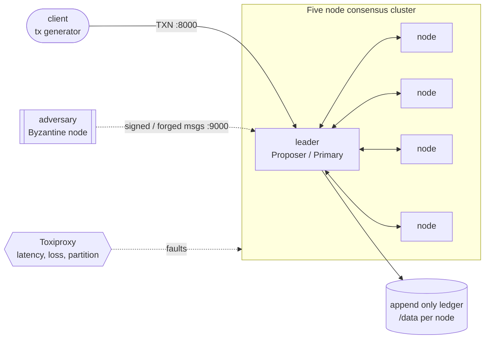
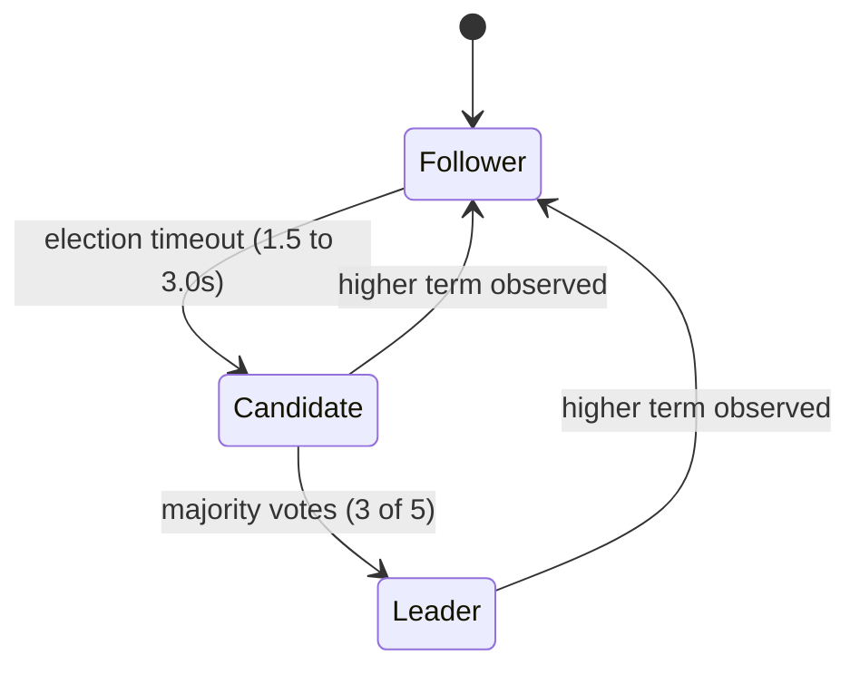

<div align="center">

# Distributed Consensus Engine

### Resilient State Machine Replication with Paxos and PBFT

A five node, append only transaction ledger that stays consistent through **crash faults** and **Byzantine faults**, orchestrated end to end with Docker and stress tested with Toxiproxy.


</div>

---

> **Course:** Fundamentals of Distributed Systems, IIT Jodhpur  &nbsp;|&nbsp;  **Assignment 1, Question 1 **
> **Repository:** https://github.com/Kirtiman-sarangi/distributed-consensus-engine
> **Report:** `project_report.pdf` (submitted as `Assignment (Q1) G25AI1024.pdf`)

---

## Table of Contents

1. [What this is](#1-what-this-is)
2. [How it maps to the assignment](#2-how-it-maps-to-the-assignment)
3. [Architecture at a glance](#3-architecture-at-a-glance)
4. [Repository structure](#4-repository-structure)
5. [Quick start](#5-quick-start)
6. [Running Mode A, Paxos](#6-running-mode-a-paxos)
7. [Running Mode B, PBFT with the adversary](#7-running-mode-b-pbft-with-the-adversary)
8. [Injecting faults and chaos testing](#8-injecting-faults-and-chaos-testing)
9. [Verifying the results](#9-verifying-the-results)
10. [How the internals work](#10-how-the-internals-work)
11. [Configuration reference](#11-configuration-reference)
12. [Verification matrix](#12-verification-matrix)
13. [Deliverables checklist](#13-deliverables-checklist)
14. [Author](#14-author)

---

## 1. What this is

The system is a distributed, append only transaction ledger replicated across five nodes. It processes a stream of client transactions while keeping every honest replica in agreement on the same ordered log, even when the network misbehaves and even when some nodes crash or actively lie. It runs in two interchangeable modes that share the same leader election and the same durable ledger.

| Mode | Protocol | Tolerates | Quorum (N = 5) |
|------|----------|-----------|----------------|
| **A. Crash fault tolerance** | Raft style leader election + Basic Paxos | up to **2 crashes** | majority = 3 |
| **B. Byzantine fault tolerance** | PBFT with RSA signed messages | **1 malicious node** | 2f + 1 = 3 |

Any two quorums always overlap in at least one honest node. That single property is what keeps both protocols safe.

---

## 2. How it maps to the assignment

Every graded task is implemented and demonstrable from this repository.

| # | Task (marks) | Where it lives | Evidence |
|---|--------------|----------------|----------|
| 1 | **Leader Election (4)** | `src/node.py` &rarr; election loop, terms, majority vote, heartbeats | `evidence/evidence-paxos-normal.txt` |
| 2 | **Paxos (4)** | `src/node.py` &rarr; Prepare, Promise, Accept, Accepted, plus DECIDE replication; disk write only on commit | `evidence/evidence-paxos-normal.txt`, `...-crash-recovery.txt` |
| 3 | **PBFT (5)** | `src/node.py` + `src/crypto_utils.py` &rarr; Pre prepare, Prepare, Commit with RSA signatures | `evidence/evidence-pbft-normal.txt` |
| 4 | **Byzantine Adversary (3)** | `src/adversary.py` &rarr; forge, tamper, equivocate, suppress | `evidence/evidence-pbft-byzantine-final.txt`, `...-no-malicious-commit.txt` |
| 5 | **Docker + Chaos Testing (4)** | `docker-compose.yml`, `tests/chaos_test.sh`, `tests/chaos_test_fixed.sh` | `evidence/evidence-chaos-paxos-fixed-final.txt` |

Technology constraints from the brief are all satisfied: the nodes, client and adversary are written purely in Python with `asyncio`; the cluster is orchestrated with Docker Compose; and faults are injected with Toxiproxy.

---

## 3. Architecture at a glance



Each node is a single `asyncio` event loop running three cooperating subsystems over shared state. Peer traffic flows on port 9000 as newline delimited JSON, and clients talk to port 9000's sibling client port 8000.

**Leader election** uses monotonically increasing terms and majority voting, which makes a split brain unreachable.



---

## 4. Repository structure

The layout follows the exact structure required by the assignment, with a few additions for evidence and demos.

```text
distributed-consensus-engine/
├── src/
│   ├── node.py            # Main daemon: leader election + Paxos + PBFT + disk ledger
│   ├── adversary.py       # Subclassed node simulating Byzantine faults
│   ├── client.py          # Submits concurrent transactions
│   └── crypto_utils.py    # RSA key generation and message signing
├── tests/
│   ├── chaos_test.sh      # Triggers Toxiproxy faults during runtime (required)
│   └── chaos_test_fixed.sh# Hardened chaos run with verified Toxiproxy syntax
├── demo/
│   ├── demo_reset.sh      # Clean slate before recording the demo
│   ├── demo_paxos.sh      # Paxos: start, commit, crash, recover
│   └── demo_pbft_byzantine.sh # PBFT: start, forge, reject, prove safety
├── evidence/              # Captured terminal logs used in the report
├── Dockerfile
├── docker-compose.yml     # 5 nodes + 1 adversary + 1 client + Toxiproxy
├── requirements.txt
├── project_report.pdf     # = "Assignment (Q1) G25AI1024.pdf"
└── README.md
```

---

## 5. Quick start

**Prerequisites:** Docker Desktop running, plus optional Python 3.11 for offline checks.

```bash
# 1. Confirm the toolchain
open -a Docker          # macOS: start Docker Desktop, wait until it is running
docker info             # should print engine details, not a socket error
docker compose version

# 2. Optional offline sanity check (no Docker needed)
python3 -m pip install -r requirements.txt
python3 -m py_compile src/*.py && echo OK
python3 src/crypto_utils.py            # crypto self test should pass

# 3. Build the image used by every container
docker compose build
```

---

## 6. Running Mode A, Paxos

```bash
# Start the five nodes plus the fault injector in crash tolerant mode
CONSENSUS_MODE=paxos docker compose up -d node1 node2 node3 node4 node5 toxiproxy

# Watch election and commits
docker compose logs -f node1 node2 node3

# In another terminal, generate transaction load
CONSENSUS_MODE=paxos docker compose up client
```

Expected log lines:

```text
[node3] ELECTED LEADER for term 1 (3/5 votes)
[node3] PAXOS COMMIT slot=12 value=transfer (majority 3/5)
[node1] PAXOS LEARN/DECIDE slot=12 value=transfer
[node3] LEDGER append seq=12 -> /data/node3.log
```

The leader commits a slot once a majority accepts, writes it to disk, then broadcasts a `DECIDE` so every follower replicates the same entry. This is what keeps all five ledgers identical.

---

## 7. Running Mode B, PBFT with the adversary

```bash
CONSENSUS_MODE=pbft ADVERSARY_MODE=forge \
  docker compose --profile byzantine up -d \
  node1 node2 node3 node4 node5 adversary toxiproxy

docker compose up -d client
```

Switch the attack with `ADVERSARY_MODE` set to one of `forge`, `tamper`, `equivocate` or `suppress`.

Expected log lines:

```text
[node1] PBFT PREPARED seq=42 -> broadcasting COMMIT
[node1] PBFT COMMIT seq=42 value=transfer (quorum 3/5, Byzantine-safe)
[node2] !! SIGNATURE REJECTED from node1 seq=999 (dropping spoofed/tampered msg)
```

Every Pre prepare, Prepare and Commit is RSA signed and verified before it is counted. A forged or tampered message fails verification and is dropped, so it can never reach the quorum.

---

## 8. Injecting faults and chaos testing

```bash
# Crash a node, then bring it back (it self heals via the sync protocol)
docker compose kill node1
docker compose up -d --no-recreate node1

# Network latency and partition through Toxiproxy
docker exec toxiproxy /toxiproxy-cli create node2_proxy --listen 0.0.0.0:19002 --upstream node2:9000
docker exec toxiproxy /toxiproxy-cli toxic add node2_proxy -t latency -a latency=800   # 800 ms latency
docker exec toxiproxy /toxiproxy-cli toxic add node2_proxy -t timeout -a timeout=0     # full partition
docker exec toxiproxy /toxiproxy-cli toxic remove node2_proxy -n node2_proxy_timeout   # heal

# Full automated chaos run under continuous client load
./tests/chaos_test_fixed.sh | tee evidence/evidence-chaos-paxos-fixed-final.txt
```

The chaos script registers Toxiproxy routes, starts continuous load, crashes the leader and a second node, injects latency and a partition, heals the network, restarts the crashed nodes, and finally compares ledger lengths across all nodes.

---

## 9. Verifying the results

```bash
# Are all five ledgers the same length?
for n in node1 node2 node3 node4 node5; do
  echo -n "$n: "; docker compose exec -T $n sh -c "wc -l < /data/$n.log"
done

# Did any malicious value ever get committed? (should print "No malicious value committed")
for n in node1 node2 node3 node4 node5; do
  echo "===== $n ====="
  docker compose exec -T $n sh -c \
    "grep -n 'DOUBLE_SPEND\|TAMPERED\|MALICIOUS' /data/$n.log 2>/dev/null || echo 'No malicious value committed'"
done

# Inspect the key events
docker compose logs node3 | grep -E "ELECTED|COMMIT|SIGNATURE"
```

Tear everything down when finished:

```bash
docker compose --profile byzantine down -v
```

---

## 10. How the internals work

<details>
<summary><b>Leader election</b> (Task 1)</summary>

Followers hold a randomised election deadline between 1.5 and 3.0 seconds, reset by every heartbeat. On timeout a follower increments its term, becomes a candidate and requests votes. A candidate that collects a majority of three becomes leader and emits heartbeats every 0.5 seconds. Seeing any higher term forces an immediate step down to follower, so two leaders cannot coexist in one term.
</details>

<details>
<summary><b>Paxos with learner replication</b> (Task 2)</summary>

Basic Paxos runs once per ledger slot with the leader as Proposer. Proposal numbers combine a counter with the node id to stay globally unique. The leader commits a slot to disk only after a majority of Accepted replies, then broadcasts a `DECIDE` message so every follower learns and writes the same value. Disk writes are flushed with `fsync`, and because every commit needs an overlapping majority the chosen value for a slot is unique even across leader changes.
</details>

<details>
<summary><b>PBFT and key distribution</b> (Task 3)</summary>

PBFT runs three signed rounds per sequence number: Pre prepare from the Primary, then Prepare and Commit from the replicas, each needing a quorum of 2f + 1 = 3. Every node generates an RSA 2048 key pair at start up, keeps the private key, and publishes its public key as PEM into a shared `/keys` volume using an atomic write. Because all containers mount the same volume, each node can verify any peer message. Signatures are RSA PSS over a SHA 256 digest of the canonical JSON payload.
</details>

<details>
<summary><b>Byzantine adversary</b> (Task 4)</summary>

`adversary.py` subclasses the node and overrides the PBFT handlers. `forge` claims another node identity but lacks its key, `tamper` mutates the payload after signing, `equivocate` sends different values to different halves of the cluster, and `suppress` stays silent. In every case the honest quorum settles on the correct value and no malicious value is committed.
</details>

<details>
<summary><b>Crash recovery and log sync</b></summary>

On start up a node reloads its ledger from disk. A background loop computes the first sequence number it is missing and broadcasts a `SYNC_REQUEST`. Any peer that has those entries replies with a `SYNC_RESPONSE`, and the recovering node fills its gaps and rejoins the converged ledger.
</details>

---

## 11. Configuration reference

| Variable | Values | Default | Meaning |
|----------|--------|---------|---------|
| `CONSENSUS_MODE` | `paxos`, `pbft` | `paxos` | Selects the consensus protocol for the whole cluster |
| `ADVERSARY_MODE` | `forge`, `tamper`, `equivocate`, `suppress` | `forge` | Which attack the adversary mounts (PBFT only) |
| `NODE_ID` | `node1` ... `node5` | per service | Identity of the container |
| `PEER_PORT` | port | `9000` | Node to node protocol port |
| `CLIENT_PORT` | port | `8000` | Client facing port |

---

## 12. Verification matrix

| Test | How | Expected success criterion |
|------|-----|----------------------------|
| Normal transaction flow | `docker compose up client` (paxos) | Every txn logs `PAXOS COMMIT`; all ledgers grow together |
| Leader election | Start the cluster | Exactly one `ELECTED LEADER for term N`; no two leaders in a term |
| Leader failure recovery | `docker compose kill <leader>` | New `ELECTED LEADER` within about 3 s; commits resume |
| Two node crash tolerance | Kill leader plus one more | Three survivors still log `PAXOS COMMIT` |
| Crash recovery sync | Kill and restart a node | Restarted node catches up; all ledgers converge |
| PBFT normal commit | pbft mode, no attack | `PBFT COMMIT seq=...` after a quorum of three |
| Byzantine detection | `ADVERSARY_MODE=forge` | `!! SIGNATURE REJECTED` in logs; bad message dropped |
| No malicious commit | Scan every ledger | `No malicious value committed` on all nodes |
| Partition recovery | Toxiproxy timeout then remove | Minority stalls, resumes after heal, ledgers converge |

---

## 13. Deliverables checklist

- [x] Single Git repository in the required folder structure
- [x] `src/node.py`, `src/adversary.py`, `src/client.py`, `src/crypto_utils.py`
- [x] `tests/chaos_test.sh` for Toxiproxy fault injection
- [x] `Dockerfile`, `docker-compose.yml` (5 nodes, adversary, client, Toxiproxy), `requirements.txt`
- [x] Consolidated chaos evaluation logs in `evidence/`
- [x] `project_report.pdf` typed as **Assignment (Q1) G25AI1024.pdf**
- [ ] Public demonstration video, maximum 5 minutes &nbsp; &rarr; &nbsp; **[vlink]**

> The video must show the `docker compose` build, a normal transaction run, and a successful recovery from an injected Byzantine fault. A scripted shot list is provided in the demo guide.

---

## 14. Author

**Roll Number:** G25AI1024
**Repository:** https://github.com/Kirtiman-sarangi/distributed-consensus-engine

Built for the Fundamentals of Distributed Systems course at IIT Jodhpur. Paxos for crashes, PBFT for adversaries, and Toxiproxy to make sure both actually hold up under pressure.
